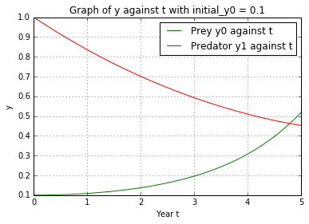
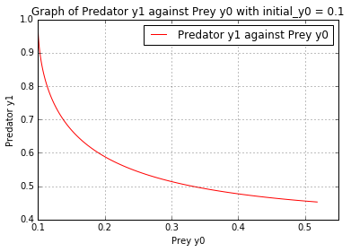

UECM3033 Assignment #3 Report
========================================================

- Prepared by: **Chur Jian Chang**
- Tutorial Group: T2

--------------------------------------------------------

## Task 1 --  Gauss-Legendre formula

The reports, codes and supporting documents are to be uploaded to Github at: 

[https://github.com/joel913/UECM3033_assign3](https://github.com/joel913/UECM3033_assign3)

**Explain how you implement your `task1.py` here.**

To perform Gauss-Legendre quadrature, we need to confirm that the integral over [a,b] is [-1,1]. Then we use Lagrange Polynomial to transform the interval to [-1,1] by using the codes: 
 y=((b-a)/2)*X+((b+a)/2)

We obtain the weights and nodes of the Gauss-Legendre quadrature using Leggauss from the module numpy.polynomial.legendre.
The codes are: 
*[X,W]=np.polynomial.legendre.leggauss(n)*

We can then obtain the answer by multiplying the Jacobian of the transformation which is (b-a)/2 with the summation of the weights and f(y).
The code is as follow:
WF=sum(W*f(y)) and 
ans=((b-a)/2)*WF

**Explain how you get the weights and nodes used in the Gauss-Legendre quadrature.**

We find the weights and nodes used in the Gauss-Legendre quadrature using the polynomial module in python. The code is as follow: *[X,W]=np.polynomial.legendre.leggauss(n)*

---------------------------------------------------------

## Task 2 -- Predator-prey model

**Explain how you implement your `task2.py` here, especially how to use `odeint`.**

I create an ODE system (ode) and the following differential equations is defined in the system.

$$ y'_0 = a(y_0 - y_0 y_1)$$ $$ y'_1 = b(-y_1 + y_0 y_1)$$

The given values are stored into a, b and init_y. Then the linspace function, *t = np.linspace(0,5,101)* is used to create 100 uniform partitions from t=0 to 5.

I used the odeint module in python to solve the ODE system. The code is as follow:
*sol = spIn.odeint(my_ode,init_y,t,args=(a,b))* 

**Put your graphs here and explain.**

This is the graph of Prey y0 and Predator y1 against Year t, where the initial condition is y0 = 0.1, y1 = 1.0. 

This is the graph of Predator y1 against Prey y0, where the initial condition is y0 = 0.1, y1 = 1.0.

.png)

This is the graph of Prey y0 and Predator y1 against Year t, where the initial condition is y0 = 0.11, y1 = 1.0

.png)

This is the graph of Predator y1 against Prey y0, where the initial condition is y0 = 0.11, y1 = 1.0

**Is the system of ODE sensitive to initial condition? Explain.**

This system of ODE is not sensitive to the initial condition. There is only a small change (small difference) between the graph when the initial value condition change from 0.1 to 0.11.

-----------------------------------

last modified: 18 April 2016

